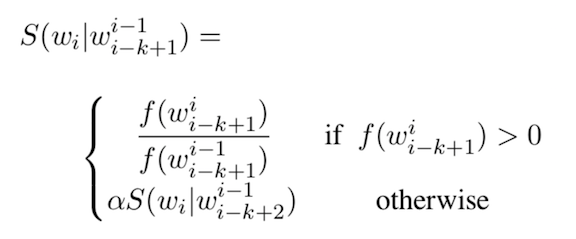
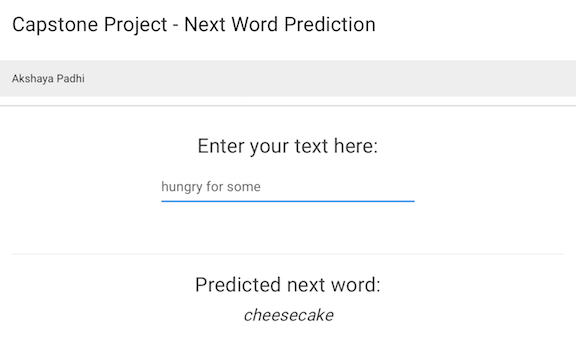

## 	Building a predictive text model
### Summary

* Shiny application created and stored [here](https://akpadhi.shinyapps.io/capstoneshinyapp/).
* Related files stored at Github[here](https://github.com/akpadhi/coursera_datascience_capstone).
* A clean corpus of blog, news and twitter data was loaded, sampled and cleaned with TM package
* Ngrams were created with RWeka package from the corpus
    + Four Ngrams are created (1 to 4)
* Stupid Backoff Model was used to predict next word aftr a phrase.

## Algorithm
### Stupid Backoff Algorithm

* Stupid Backoff algorithm, does not generate normalized probabilities, directly use the relative frequencies 

## 	Shiny App interface
### Features
* A text input box with Focus in the box for user to type a word/phrase
    + Suggests word-completion with use of unigram
    + Predicts the next word reactively on completion of typing
* Prediction with longest Ngram (4-gram) followed by next shortest till bigram.
		+ Most frequent word from the Ngram table is suggested.

## 	Shiny App

## Future work and links
The current prediction model  model will be improved

1. Increase Corpus size and/or type.
2. Create more complex model for better prediction and more choices
3. More featurs will be added to App

* Related files stored at Github[here](https://github.com/akpadhi/coursera_datascience_capstone).
* Shiny Application hosted at link [here](https://akpadhi.shinyapps.io/capstoneshinyapp/).

